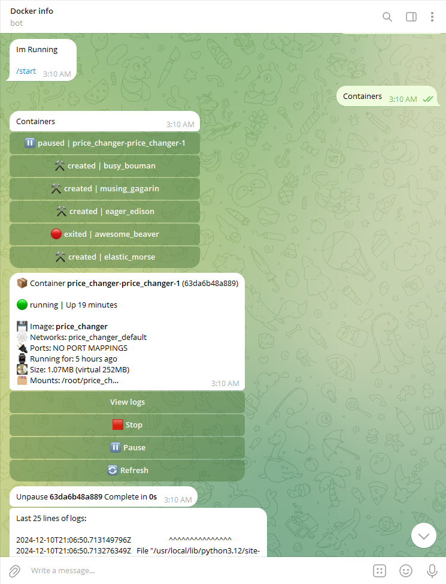

# 🐳 docker-status-bot 

#### Check states of your containers, see its logs and manipulate them via telegramm bot 📱

### Runs on:  

***

## Current functionality:
- ##### 📦 See all containers and their info
- ##### 🔨 Start / Stop / Pause / Unpause
- ##### 📁 See container logs
- ##### 📃 Log containers manipulations
- ##### 🗃 Docker compose Start / Stop

## TODO:
- #### Alarms of container stops
- #### Further docker compose compability
- #### Docker exec command
- #### Create images and containers
- #### Remove images and containers
- #### REST API
- #### Move to python 3.12 + (aiogram 2.x -> 3.x)

***

### Example usage:

